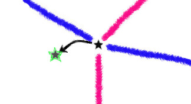

# Time

The more you dig in to the notion of **time**, the weirder things get. Time is an everyday idea, but it's very hard to understand what it actually is. Fortunately, *Galapagotchi* has a fictional model of time which is as straightforward as possible.

First of all, *time* is not continuous here, it passes in discrete steps. The time steps consist of two phases, and they operate on a body as a whole. Anywhere [intervals](interval.md) are connected together at [joints](joint.md) to make what we call a *fabric* (the *gotchi* body), the phases must follow each other.

Two separate *gotchi* bodies can exist in their own *time* because they don't interact physically, which is why they can [evolve](evolution.md) like ghosts in the same space.

### Daytime: intervals push or pull

If we imagine the time steps being like *day* and *night* (passing by extremely quickly), we can say that what happens during the day is that each and every [interval](interval.md) in a *fabric* gets a chance to push or pull on its two [joints](joint.md). Whether it decides to push or to pull will depend on how its current length compares to its preferred length.

So the *day* begins with all *joints* cleared of forces. Every time an *interval* pushes or pulls, its two *joints* accumulate the forces exerted, and since the *joints* have **no mass** of their own, the *intervals* also accumulate a sum of their masses at each *joint*.

At the end of the *day*, each interval has had its chance to express itself, and every *joint* is holding accumulated force and mass from its intervals.

### Nighttime: joints move

After *nightfall*, it is time for the [joints](joint.md) to wake up and move. Each joint takes its accumulated force vector and divides it by its accumulated interval masses to arrive at an **acceleration** vector. This vector is a reflection of where and how urgently the *joint* wants to move, so the momentum vector is added to the *joint*'s **velocity**.

The special effect of [gravity](gravity.md) has to happen at *night* as well, adding an acceleration that depends on where each individual joint finds itself with respect to the surface: above or below. Also, the other effects of drag are allowed to have an effect on the *velocity*.

When the forces have acted upon the *joint* to nudge the *velocity* vector, the joint finally makes its actual move by stepping in the direction of its velocity vector.

By the end of the *night*, all joints have moved, and they are now in a new *location* in space. This changes the lengths of the *intervals*, and in turn the forces that they will exert *tomorrow*.

### Movie frames

This day/night cycle is repeated **more than a thousand times per second** when you are watching *Galapagotchi* bodies move.

About once every *50 day/night cycles*, the *Galapagotchi* app takes a **snapshot** of all *joint* locations and produces the next frame of the animation for users to see. If it were to show a frame every *day*, the animation would either be *very slow* or the structures would be *very unstable*. 