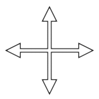

# Genes

All growth and behavior in *Galapagotchi* is determined by **genes**.  Each *gene* is encoded as a **sequence of dice**. This mixes metaphor into the story, triggering *intuition*, since everyone knows how *dice outcomes* work.

The [evolution](evolution.md) process is purely trial-and-error, so whenever a change is made it amounts to picking up a few of the *dice* in the gene sequence and tossing them. Mutations are tosses of the dice.

To get the idea, imagine reading the following sequence and having the dice decide for you next small step to take:

# ⚁ ⚂ ⚃ ⚂ ⚀ ⚄ ⚅ ⚂ ⚂ ⚅ ⚂ ⚃ ⚁ ⚁ ⚄ ⚀ ⚅ ⚄ ⚅ ...

### Growth gene

During [growth](growth.md) is being done using these genes as a program, where decisions are made at ever step. 

If a decision is very simple, it will depend on reading **one** die from the gene sequence, but if a choice must be made among many more options, the gene interpreter just reads **multiple** dice and combines them to get an answer. By combining enough dice, any complex decision can be made.

After the *gotchi* body has grown its full size, the genes for **behavior** are read and *executed* by attaching instructions to the [muscles](muscle.md) about when to push or pull get *shorter* or *longer* during a [time](time.md) sweep.

### One behavior gene per direction

The *gotchi* bodies survive by having the genes that make them run faster than others, but they are also able to turn left and right.  There is one gene for each of the four directions: forward, backward, left and right.

A *gotchi* proves its running and turning ability by going on a [journey](journey.md) made up of a series of visits to the home [hexalot](hexalot.md) of other *gotchis*. To complete its journey, a *gotchi* not only has to run but it must also develop the ability to move in the correct direction when its [sense of direction](sense.md) dictates.

When it must make a left turn, say, it will sense that the next direction to go is *left* and it will switch its behavior to what is recorded in the *left* direction gene. This continues until the *gotchi* no longer feels that it must turn left.

Interestingly, if the *gotchi* has already developed and refined its *forward* running gene, it will typically **learn to turn** instead of learning to crawl to the left here. The reason is that the *left* gene has the effect of turning rather than crawling, the *gotchi* will switch back to its *forward* gene soon after, and this will be a very positive outcome since that gene is already working.