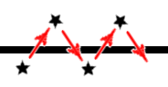
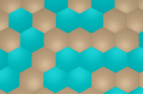

# Gravity

At first glance, **gravity** is nothing more than an acceleration *downward* which must be added to all of the [joints](joint.md) during every cycle of [time](time.md), but it gets a bit more complicated than that.

Sounds simple, but *running* is about a body interacting with a **surface** in the context of gravity. It turns out that gravity is quite meaningless without the surface, and that the physics of reacting to the surface is one of the more complicated bits of code.

### Below the surface

Not only does the surface need to *push back up* hard when a part of the body is underneath, but it also has to be **non-slippery**. That means that velocity above the surface must be dampened only a little bit, but when a [joint](joint.md) goes below the surface, it's velocity vector must be quickly reduced to almost a *standstill*.

It gets even more complicated when you realize that [time](time.md) operates in discrete steps, and that the *surface* has to push upwards **more** or **less**, depending on how deep a [joint](joint.md) finds itself. The difficulty arises because the depth of the *joint* after any given *time* cycle is arbitrary (within a small range, but still critical). It depends almost entirely on whatever altitude of the joint at the end of the *previous cycle*.

Discrete time introduces the danger of oscillations when a *joint* is so near the surface that every [time](time.md) step takes it to the opposide side of the surface.

### Land and water

When the surface is made up of both *land* and *water*, the *joint* must not only know how deep it is, but also where it is. This means making a decision at the moment that a *joint* goes under based on **where**, land or water. In the *Galapagotchi* universe this involves deciding which hexagon spot as quickly as possible, which is not too hard. Meanwhile, distinguishing land and water is basically the simplest surface feature imaginable. Making the surface more elaborate will quickly add complexity, so start simple.

